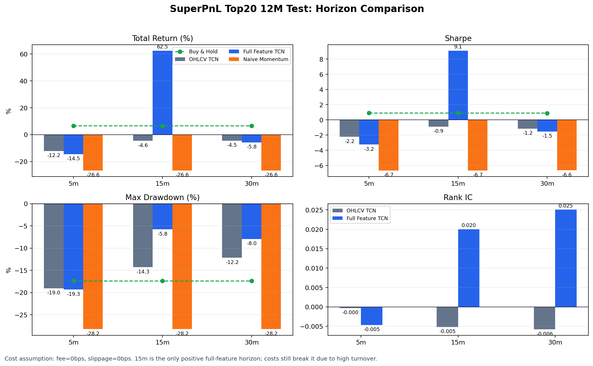

# SuperPnL

SuperPnL 是一个面向 **可交易 PnL** 的预测模型研究项目。当前版本聚焦 OKX 加密货币现货市场，用 1min K 线和历史因子预测未来多个策略 horizon 的收益，并通过 long-only 仓位回测评估模型是否真的能带来 PnL。

这个项目的核心不是“把下一根 K 线价格预测得更准”，而是回答一个更直接的问题：

```text
在当前时刻 t，只使用 t 及以前可见的数据，是否应该持有某个现货标的，
持有多少仓位，持有到哪个 horizon，扣除交易成本后是否仍有收益空间？
```

当前仓库已经包含：

- OKX 现货 Top20 / 1min K 线下载脚本。
- 训练特征与标签生成逻辑。
- OHLCV-only baseline 和有因子模型。
- no-trade、buy-and-hold、naive momentum、OHLCV-only、有因子模型的统一评测。
- 5m / 15m / 30m horizon 的实验结果、回测对比图和下游策略提示词。

> 重要结论：当前实验只证明 `full_feature_tcn_15m` 在零成本回测下有明显 PnL。由于换手很高，加入真实 maker/taker 费率和滑点后会被成本打穿，因此不能把当前零成本结果直接理解成可实盘净收益。

## 当前结论

本轮实验使用 OKX 现货非稳定币 `*-USDT` Top20，数据窗口为 `2025-04-30 15:00:00 UTC` 到 `2026-04-30 15:00:00 UTC`，每个 symbol 有 `525,601` 根 1min K 线。

主实验为零成本回测，即：

```text
fixed_fee_bps = 0
fixed_slippage_bps = 0
threshold_bps = 0
```

5m / 15m / 30m 结果对比：



| 模型 | horizon | total_return | sharpe | max_drawdown | turnover | trades | 结论 |
| --- | ---: | ---: | ---: | ---: | ---: | ---: | --- |
| no_trade | - | 0.00% | 0.000 | 0.00% | 0.0000 | 0 | 空仓基准 |
| buy_and_hold_equal_weight | - | 6.57% | 0.894 | -17.34% | 0.0000 | 20 | 等权持有基准 |
| naive_momentum | 5m/15m | -26.61% | -6.653 | -28.24% | 0.0851 | 134,121 | 规则动量不可用 |
| ohlcv_tcn | 5m | -12.16% | -2.233 | -19.04% | 0.2370 | 373,578 | OHLCV-only 不可用 |
| ohlcv_tcn | 15m | -4.57% | -0.883 | -14.30% | 0.2973 | 468,544 | OHLCV-only 不可用 |
| full_feature_tcn | 5m | -14.49% | -3.249 | -19.33% | 0.3167 | 499,082 | 有因子但 5m 不可用 |
| full_feature_tcn | 15m | 62.46% | 9.099 | -5.79% | 0.2472 | 389,591 | 当前唯一正向结果 |
| full_feature_tcn | 30m | -5.80% | -1.532 | -7.95% | 0.1594 | 251,256 | 30m 暂不推荐 |

当前判断：

- `15m` 是唯一值得继续研究的 horizon。
- `5m` 噪声太高，当前因子和模型没有转化成 PnL。
- `30m` 零成本下仍为负，虽然换手更低，但暂不适合作为主策略。
- 有因子模型在 `15m` 明显优于 OHLCV-only，说明历史因子对 15m PnL 有增量价值。
- 15m 的收益集中在高波动小币，尤其 ZKJ、BIO、APE、PI、PEPE，样本外稳定性仍需要继续验证。

## 项目定位

SuperPnL 的设计目标是建立一个从数据到策略评估的 PnL-first 研究框架。

```text
OKX 1min OHLCV
        ↓
历史技术因子 / 市场因子 / 截面因子 / 时间因子
        ↓
Bar Encoder + Factor Encoder
        ↓
Gated / FiLM Fusion
        ↓
Return Head + Position Head
        ↓
long-only target position in [0, 1]
        ↓
PnL / turnover / drawdown / cost sensitivity
```

这里的 `TCN` 指 Temporal Convolutional Network，用一维因果卷积读取过去 `lookback` 根 K 线序列。它比简单 MLP 更适合处理时间序列，又比 Transformer 更轻，适合当前阶段快速实验。

`Gated / FiLM Fusion` 是把 K 线序列表示和外生因子表示融合的方法：

- `Gated Fusion`：模型学习一个门控权重，决定当前样本更依赖 K 线本身还是依赖外生因子。
- `FiLM Fusion`：外生因子生成缩放和偏移参数，对 K 线表示做条件调制，让同样的 K 线形态在不同市场环境下有不同解释。

当前代码实现采用轻量版本，重点先验证因子是否能提升 PnL，不追求模型结构复杂度。

## 适用范围

当前版本只覆盖：

- OKX spot。
- `*-USDT` 现货交易对。
- long-only 现货仓位，仓位范围 `0..1`。
- 1min K 线数据。
- 策略 horizon 可配置为 5m、15m、30m 或其他分钟级 horizon。
- 固定费率和固定滑点的回测配置。

当前版本不覆盖：

- 永续合约、杠杆、借币做空。
- funding、open interest、basis 等衍生品特征。
- 盘口数据、订单簿深度、实时撮合模拟。
- 真实交易执行系统。
- 组合级资金容量建模。

如果后续加入盘口、成本、流动性指标，需要重新生成训练数据并重新训练模型。原因是输入特征分布、特征维度和模型学习到的条件关系都会变化，不能只在旧模型后面简单追加字段。

## PnL 定义

现货 long-only 场景下，PnL 可以理解为“持仓带来的净资产变化”。

简化定义：

```text
ret_t = log(open_{t+h+1} / open_{t+1})
position_t ∈ [0, 1]
gross_pnl_t = position_t * ret_t
turnover_t = abs(position_t - position_{t-1})
cost_t = turnover_t * (fee_bps + slippage_bps) / 10000
net_pnl_t = gross_pnl_t - cost_t
```

当前训练标签使用：

```text
label_h = log(open_{t+h+1} / open_{t+1})
```

含义是在 `t` 时刻做决策，下一根 K 线开盘进入，在 horizon 后的下一根开盘退出。这样可以避免用当前 bar 的 close 作为不可成交的入场价。

当前主实验 `fee_bps=0`、`slippage_bps=0`，所以报告的是零成本 PnL。真实下游策略必须重新评估成本、换手和最短持仓约束。

## 文档地图

| 目标 | 文档 |
| --- | --- |
| 理解完整 PnL-first 架构 | [docs/SUPERPNL_DESIGN_SPEC.md](docs/SUPERPNL_DESIGN_SPEC.md) |
| 查看特征 schema 和泄漏判断 | [docs/FEATURE_SCHEMA.md](docs/FEATURE_SCHEMA.md) |
| 理解回测指标、baseline 和评测计划 | [docs/BACKTEST_AND_EVALUATION_PLAN.md](docs/BACKTEST_AND_EVALUATION_PLAN.md) |
| 理解下游策略如何使用模型输出 | [docs/DOWNSTREAM_USAGE.md](docs/DOWNSTREAM_USAGE.md) |
| 查看 Top20 / 12 个月实验报告 | [docs/TOP20_12M_EXPERIMENT_REPORT.md](docs/TOP20_12M_EXPERIMENT_REPORT.md) |
| 复现实验和理解 Top20 币池 | [docs/REPRODUCIBILITY_AND_TOP20_UNIVERSE.md](docs/REPRODUCIBILITY_AND_TOP20_UNIVERSE.md) |
| 给 BitPro 项目实现策略的提示词 | [docs/BITPRO_STRATEGY_PROMPT.md](docs/BITPRO_STRATEGY_PROMPT.md) |
| 查看 5m / 15m / 30m 对比图 | [docs/charts/superpnl_horizon_comparison.png](docs/charts/superpnl_horizon_comparison.png) |

## 数据口径

本次实验币池不是市值 Top20，也不是永远固定的市场 Top20，而是：

```text
下载当时 OKX 现货 *-USDT 中，
剔除稳定币 base 后，
按 24h 成交额排序，
并且 1min 历史覆盖满 365 天的前 20 个标的。
```

固定币池：

```text
BTC-USDT, ETH-USDT, DOGE-USDT, SOL-USDT, XRP-USDT,
PEPE-USDT, TRX-USDT, XAUT-USDT, BIO-USDT, PENGU-USDT,
PI-USDT, ZKJ-USDT, TRUMP-USDT, SUI-USDT, FIL-USDT,
ADA-USDT, APE-USDT, CHZ-USDT, LINK-USDT, LTC-USDT
```

关键数据统计：

| 项 | 值 |
| --- | --- |
| exchange | OKX |
| market | spot |
| quote | USDT |
| bar_size | 1m |
| symbols | 20 |
| raw window | `2025-04-30 15:00:00 UTC` -> `2026-04-30 15:00:00 UTC` |
| rows per symbol | `525,601` |
| common timestamps after feature/label filtering | `525,596` |
| train / val / test | 按时间切分 70% / 15% / 15% |

数据和训练产物都不提交进 git：

```text
data/
outputs/
artifacts/
checkpoints/
*.pt
*.npz
```

## 特征与标签

当前输入分两类。

OHLCV bar inputs：

```text
open_rel
high_rel
low_rel
close_rel
volume_z_30m
amount_z_30m
```

历史因子 inputs：

```text
ret_5m, ret_15m, ret_30m
rsi_5m, rsi_15m, rsi_30m
vol_std_5m, vol_std_15m, vol_std_30m
ma_dev_5m, ma_dev_15m, ma_dev_30m
boll_z_5m, boll_z_15m, boll_z_30m
macd_5m_15m, macd_15m_30m
market_ret_5m, market_ret_15m, market_ret_30m
market_vol_5m, market_vol_15m, market_vol_30m
cross_section_ret_rank_5m, cross_section_ret_rank_15m, cross_section_ret_rank_30m
cross_section_vol_rank_5m, cross_section_vol_rank_15m, cross_section_vol_rank_30m
hour_sin, hour_cos
dayofweek_sin, dayofweek_cos
```

`5m/15m/30m` 是真实时间窗口，不是数据粒度。当前只下载 1min K 线，所以：

```text
ret_15m = log(close_t / close_{t-15})
```

如果未来使用 5min K 线，`15m` 窗口就对应过去 3 根 5min bar。为了避免混淆，特征名继续使用真实时间窗口，而不是写成 `ret_3` 或 `ret_15bars`。

新增因子必须逐项说明未来信息泄漏风险。当前默认特征的约束是：

- rolling / EMA / rank 都只能使用 `<= t` 的历史数据。
- 标准化均值和标准差只在 train split 上拟合。
- 截面 rank 只能使用同一时刻已经可见的币池数据。
- 不能使用 future volume、future slippage、centered rolling、全样本 z-score。
- 不能用未来成交额或未来上市状态重新选择历史币池，否则会产生幸存者偏差。

## 模型与 baseline

训练脚本会同时评估：

| 名称 | 含义 |
| --- | --- |
| `no_trade` | 永远空仓，验证评测流程的零收益基准 |
| `buy_and_hold_equal_weight` | Top20 等权买入持有 |
| `naive_momentum` | 简单动量规则 |
| `ohlcv_tcn` | 只使用 OHLCV bar inputs 的 TCN baseline |
| `full_feature_tcn` | OHLCV + 历史因子的 TCN 模型 |

评测时必须同时报告无因子 baseline 和有因子模型，不能只报告有因子模型的绝对收益。否则无法判断收益来自模型结构、市场 beta，还是来自新增因子。

当前推荐继续研究：

```text
model = full_feature_tcn
horizon = 15m
lookback = 256
feature_windows = 5,15,30
```

当前不推荐：

```text
horizon = 5m
horizon = 30m
直接使用 pred_ret > 0 逐分钟翻仓
```

## 快速开始

### 1. 准备环境

```bash
cd /Users/jie.feng/wlb/SuperPnL
python3 -m venv .venv
source .venv/bin/activate
python3 -m pip install -e .
```

项目依赖定义在 [pyproject.toml](pyproject.toml)：

```text
numpy
pandas
torch
```

### 2. 在服务器下载 OKX 数据

本地如果无法连接 OKX，可以在服务器上下载：

```bash
ssh root@47.79.36.92
```

服务器执行：

```bash
python3 /opt/bitpro/superpnl/scripts/download_okx_spot_1m.py \
  --out /opt/bitpro/data/superpnl/okx_spot_1m_top20_365d \
  --top 20 \
  --days 365 \
  --workers 4 \
  --rate 8 \
  --sleep 0
```

下载脚本会：

1. 获取 OKX spot instruments。
2. 获取 spot tickers。
3. 保留 `*-USDT` 现货。
4. 剔除稳定币 base。
5. 按 24h 成交额排序。
6. 检查 1min 历史是否覆盖 365 天。
7. 并发下载确认 K 线。
8. 写出 `metadata.json` 和每个 symbol 的 `csv.gz`。

### 3. 同步数据到本地

```bash
rsync -az --delete \
  root@47.79.36.92:/opt/bitpro/data/superpnl/okx_spot_1m_top20_365d/ \
  data/okx_spot_1m_top20_365d/
```

期望目录：

```text
data/okx_spot_1m_top20_365d/
├── metadata.json
└── csv/
    ├── BTC-USDT.csv.gz
    ├── ETH-USDT.csv.gz
    └── ...
```

完整性检查：

```bash
python3 - <<'PY'
import gzip
import json
import os

root = "data/okx_spot_1m_top20_365d"
with open(os.path.join(root, "metadata.json")) as f:
    meta = json.load(f)

for sym in meta["symbols"]:
    path = os.path.join(root, "csv", f"{sym}.csv.gz")
    with gzip.open(path, "rt") as f:
        rows = sum(1 for _ in f) - 1
    print(sym, rows)
PY
```

期望每个 symbol 都输出：

```text
525601
```

### 4. 运行 5m / 15m 实验

```bash
PYTHONPATH=src python3 scripts/run_superpnl_experiment.py \
  --raw-dir data/okx_spot_1m_top20_365d \
  --cache-dir data/cache/okx_spot_1m_top20_365d_l256_h5_15 \
  --out-dir outputs/superpnl_top20_365d_l256_h5_15_hd64_e3 \
  --lookback 256 \
  --horizons 5,15 \
  --feature-windows 5,15,30 \
  --epochs 3 \
  --samples-per-epoch 200000 \
  --batch-size 1024 \
  --hidden-dim 64 \
  --validation-samples 100000 \
  --fixed-fee-bps 0 \
  --fixed-slippage-bps 0 \
  --rebuild-cache
```

### 5. 运行 30m 实验

```bash
PYTHONPATH=src python3 scripts/run_superpnl_experiment.py \
  --raw-dir data/okx_spot_1m_top20_365d \
  --cache-dir data/cache/okx_spot_1m_top20_365d_l256_h30 \
  --out-dir outputs/superpnl_top20_365d_l256_h30_hd64_e3 \
  --lookback 256 \
  --horizons 30 \
  --feature-windows 5,15,30 \
  --epochs 3 \
  --samples-per-epoch 200000 \
  --batch-size 1024 \
  --hidden-dim 64 \
  --validation-samples 100000 \
  --fixed-fee-bps 0 \
  --fixed-slippage-bps 0 \
  --rebuild-cache
```

### 6. 重新生成对比图

```bash
PYTHONPATH=src python3 scripts/plot_horizon_comparison.py
```

输出：

```text
docs/charts/superpnl_horizon_comparison.png
```

## 输出文件

每次训练输出目录结构：

```text
outputs/<run_name>/
├── REPORT.md
├── metrics.json
├── run_config.json
├── ohlcv_tcn.pt
├── ohlcv_tcn_history.json
├── ohlcv_tcn_test_predictions.npz
├── full_feature_tcn.pt
├── full_feature_tcn_history.json
└── full_feature_tcn_test_predictions.npz
```

关键文件含义：

| 文件 | 用途 |
| --- | --- |
| `REPORT.md` | 单次实验的人类可读报告 |
| `metrics.json` | baseline、预测指标、回测指标、按月和按 symbol 统计 |
| `run_config.json` | 本次实验完整配置 |
| `*_history.json` | 训练和验证过程 |
| `*_test_predictions.npz` | test split 的预测值、标签和时间索引 |
| `*.pt` | PyTorch 模型权重，不提交 git |

补充成本敏感性分析会额外生成：

```text
cost_threshold_sensitivity.json
```

它记录不同 `threshold_bps`、`fixed_fee_bps`、`fixed_slippage_bps` 组合下的回测结果。当前仓库保留结论和报告，不提交 `outputs/` 下的分析产物。

## 下游策略使用方式

当前下游只建议消费 `full_feature_tcn_15m` 的预测结果，并在策略层增加换手约束。

推荐的策略层约束：

- 只在 `15m` horizon 上做第一版策略。
- 在 validation split 上选择 `threshold_bps`，不能在 test split 上调参。
- 增加最短持仓时间，例如至少持有 15 到 30 分钟。
- 增加冷却时间，避免连续反复开平。
- 做 top-k 或分位数选币，而不是所有 `pred_ret > 0` 的币都买。
- 做仓位平滑，例如目标仓位从 0 到 1 分多步调整。
- 限制单 symbol 最大权重，特别是高波动小币。
- 用真实 maker/taker 费率和滑点重新回测。

一个更合理的下游流程：

```text
每分钟确认 1min K 线
        ↓
生成和训练一致的特征
        ↓
加载 full_feature_tcn
        ↓
读取 pred_ret_15m
        ↓
validation 选择 threshold / top-k / holding rule
        ↓
生成 target_pos
        ↓
执行前做成本、最小下单额、仓位上限、冷却时间检查
```

给 BitPro 项目实现策略时，优先使用：

```text
docs/BITPRO_STRATEGY_PROMPT.md
```

## 成本与流动性说明

当前用户交易量很小，因此第一版没有把盘口、成本、流动性作为模型输入特征。它们只作为回测配置或后续扩展项。

当前暂不进入训练的字段包括：

```text
fee_bps
slippage_bps_est
spread_bps
depth_10bps
depth_50bps
order_imbalance_10bps
capacity_ratio
```

这些字段如果未来加入，需要注意：

- `fee_bps` 可以作为账户或交易所配置，通常没有未来泄漏。
- `slippage_bps_est` 如果来自历史成交或盘口估计，必须只使用 `<= t` 的数据。
- `spread_bps`、`depth_10bps`、`depth_50bps`、`order_imbalance_10bps` 来自盘口快照，必须保证时间戳不晚于决策时刻。
- `capacity_ratio` 只能使用历史成交额或当前可见盘口，不能使用未来成交量。
- `future_realized_slippage`、`future_volume` 不能作为输入特征，它们属于未来信息。

主实验成本敏感性已经显示：`full_feature_tcn_15m` 零成本为正，但加入 maker `8bps` 或 taker `10bps + 2bps slippage` 后会被高换手打穿。所以下一步真正要解决的是“降低换手”和“成本感知训练”。

## 复现检查

语法检查：

```bash
PYTHONPATH=src python3 -m py_compile \
  scripts/download_okx_spot_1m.py \
  scripts/run_superpnl_experiment.py \
  scripts/plot_horizon_comparison.py \
  src/superpnl/*.py
```

常见复现问题：

| 问题 | 检查点 |
| --- | --- |
| Top20 不一致 | 使用 `metadata.json` 固化币池，不要重新按当前 24h 成交额选币 |
| 行数不一致 | 检查是否只保留 OKX `confirm=1` 的 K 线 |
| test 时间段不同 | 检查 `lookback`、`horizons`、`feature_windows` 是否一致 |
| 结果有小幅差异 | 检查 `seed=17`、PyTorch 版本、CUDA/MPS/CPU 差异 |
| PnL 加成本后消失 | 当前换手过高，是已知限制 |
| 数据被误提交 | 检查 `.gitignore` 是否覆盖 `data/`、`outputs/`、`*.pt`、`*.npz` |

## 目录结构

```text
SuperPnL/
├── docs/
│   ├── SUPERPNL_DESIGN_SPEC.md
│   ├── FEATURE_SCHEMA.md
│   ├── BACKTEST_AND_EVALUATION_PLAN.md
│   ├── DOWNSTREAM_USAGE.md
│   ├── TOP20_12M_EXPERIMENT_REPORT.md
│   ├── REPRODUCIBILITY_AND_TOP20_UNIVERSE.md
│   ├── BITPRO_STRATEGY_PROMPT.md
│   └── charts/
│       └── superpnl_horizon_comparison.png
├── scripts/
│   ├── download_okx_spot_1m.py
│   ├── run_superpnl_experiment.py
│   └── plot_horizon_comparison.py
├── src/
│   └── superpnl/
│       ├── data.py
│       ├── metrics.py
│       ├── model.py
│       └── training.py
├── AGENTS.md
├── pyproject.toml
└── README.md
```

## 下一步

当前最有价值的迭代顺序：

1. 在 validation split 上搜索 `threshold_bps`、top-k、最短持仓时间和冷却时间。
2. 把 `pred_ret > 0` 的二值翻仓改成平滑仓位。
3. 在 loss 或 label 中加入交易成本和 turnover penalty。
4. 降低对 ZKJ/BIO 等小币的收益集中度。
5. 重新下载新的 out-of-sample 时间段验证 15m 是否仍有效。
6. 再决定是否加入盘口、成本和流动性特征。

在这些步骤完成前，SuperPnL 更适合作为研究信号和策略原型，不应直接作为实盘交易系统使用。
